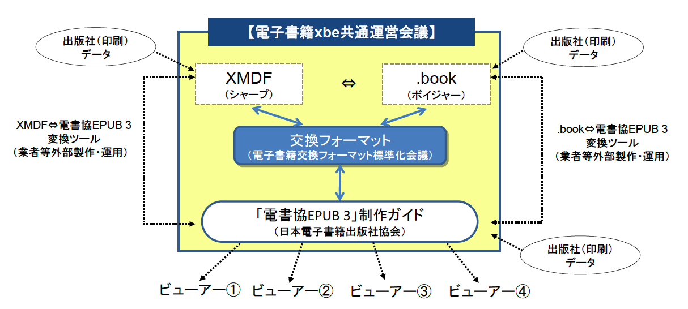

# このガイドについて

## ■目的

当ガイドは、電書協加盟社のための、一般書のEPUB 3を制作する際のガイドです。

EPUB 3を制作する際には、いくつかの方法があり、その結果、電書協加盟社が、EPUB 3の制作を躊躇しているのが現状です。また、リーディングシステム（ビューワー）開発メーカーも、出版社の意向をわかりかねていると思われます。よって、電書協加盟社のためのひとつのガイドとして、EPUB 3の制作の方向を示すことで、こうした問題を解消するために作成しました。

当ガイドは、新たなEPUB 3を作成するためだけのものではありません。

電書協加盟社は、これまで、数万点のXMDF、.bookを作ってきました。これらのコンテンツを活用させるべく、xbe共通運営会議（下図参照）を立ち上げました。この会議では三省懇談会を経て、総務省 平成22年度「新ICT利活用サービス創出支援事業（電子出版環境の整備）」の一事業として、電書協が受託・仕様策定した電子書籍交換フォーマットを介したEPUB 3への活用も視野に入れ、当ガイドを作成しました。

## ■概要

この「電書協 EPUB 3 制作ガイド」は主として組み方向の混在や段組などのないシンプルな体裁の書籍を、リフロー型の電子書籍として記述するための指針として用意されました。ページ内の任意の場所にテキストや画像を配置したり、画像の周囲をテキストが回り込むようなデザイン、凝った見出しのレイアウト等については今回見送っています。

ただし、一部の詩集や図表の多い専門書のような、リフロー型ではまだ再現が難しいレイアウトを読者に提示するための手段のひとつとして、当ガイドでは、簡易な固定レイアウトの記述について触れています。

当ガイドにおけるリフロー型の記述では、リーディングシステム（以下 RS）が対応するのに少し敷居が高いと思われる SVG の利用も見合わせました。そのため、画像のページフィットにはいくつかの制限が存在しています。たとえば、画像の原寸サイズよりも大きく拡大してみせることはできないこと、画像のサイズや位置を細かく制御できないこと、ページフィットさせた画像の周囲に枠線を引いたりできないことなどです。

一方で、一部の RS が内部でリフローと固定レイアウトで処理を切り替えているケースなども踏まえ、固定レイアウト型の記述では、 SVG の伸縮機能を利用して、画像ファイルをページのサイズに応じて拡大・縮小表示させる（ページフィットさせる）方法を選択しました。

また、固定レイアウトで問題になりがちなイメージマップ（クリッカブルマップ）についても、SVG の手法を用いています。現在、HTML の map 要素による手法では、縮小表示させた画像における座標の扱いが描画エンジンによって異なります。こうした事情も、固定レイアウトに SVG を採用した理由のひとつです。

こうした問題はいずれ解消されることを期待し、今回のガイドでは、最低限の画像配置のみを想定して記述の指針を定めました。しかし現状では、それすら RS により解釈や対応度合いが異なり、同じように表示されない場合が存在します。これは画像表示に限ったことではなく、文字や行に対する指定であっても同様です。

せっかく Web 標準技術を組み合わせて考えられた EPUB だというのに、ベンダーごとに Web ブラウザによる基礎的な部分の解釈が大きく異なっていた 10 年近く前のような状況がなお続いています。また一般的な Web ブラウザと異なり、電子書籍の RS はその仕様が外部に対してオープンでなかったり、手軽にデータを出し入れして動作検証できない場合などもあるため、それらで共通の動作を期待するデータを記述するのに、多くの困難を抱えているのが実情です。

そのため本ガイドでは、IDPF の提携団体である Readium Foundation が提供している Readium の挙動等を参考にしつつ、組版表現の再現に用いる、ごく基本的な指定に対する RS 側の解釈をなるべくシンプルに想定し、記述するという方針をとりました。現状の商用 RS の性能や、解釈の共通項などを踏まえ、本来 EPUB 3 で利用可能とされているものから、さらに大きく絞りこんだ一部機能のみの利用を想定したものとなっています。

また、利用するスタイルシートセットを事前に用意し、基本的にはその範囲内で記述を行うような方法としました。これは、まだ複数 RS 間で利用可能な機能が安定しない現在の状況において、本ガイドで推奨・想定しない CSS プロパティやその使い方が、書籍データ内の指定に無自覚に含まれることを極力防ぐため、及び、縦組みページと横組みページで同じ指定書式を利用可能にする、論理方向的な class 名を用意するためというのが主な理由です。文書構造そのものは最低限の HTML 要素で表現することとし、class 名や id 等を駆使して作品構造まで細かく規定するといった構成にはしませんでした。

表示装置により、著者や編集者が意図した表示をさせられない場合があるという状況は、けっして好ましいものではありません。テキストをリフローさせたり、文字サイズを動的に変更させるといった読者の便宜を図る目的に応えるために、ある程度レイアウトが犠牲になるのは、電子書籍の特性や現在の機能の制約上やむを得ないところもあるでしょう。ですが、テキストや画像のセンター位置が RS により異なっていたり、一部の文字の向きが異なっていたり、表示制御の方法が RS ごとに異なっているというのは、それとはまた別の次元の話です。こうした誰の得にもならない不統一は、早期に解消されることを強く望みます。

また今後、よりその存在が重要になってくる、書籍データ制作の助けとなるであろうオーサリングツール類が、無理な回避策などで複雑すぎる記述をせずとも、どの RS でも同じように表示できるソースを安心して出力できるようになることを期待しています。

本ガイドはその機能的な面も含め、まだ商用書籍の満足ゆく電子化を担うのにけっして充分なものとは言い難いかもしれませんが、そうした混乱を収束してゆくための一助となることを願っています。

## ■ガイドの構成

* 「リーディングシステムに期待する動作」

まず最初に、本ガイドによる書籍データの記述を行うにあたり、想定する RS の挙動について触れたのが本項です。主に、現在の各商用 RS 間で不統一があり、制作の障害となりがちなもの、また、動作が保証されないと困るような基礎的な部分等について記してあります。

* 「各版元が用意すべきもの」

本ガイドの範疇外であり、必要に応じて版元が各自で用意しなくてはならないもの等について記されています。

* 「制作記述の基本項目」

書籍データを記述するにあたっての、前提となる基本的なルール等について記してあります。

* 「EPUB 構成ファイルのテンプレート一覧」

実際の記述に用いることができる、基本的なページのテンプレート集です。
また、本ガイドでは推奨しないものではありますが、版元の要望が特に高い「縦組みでのテキスト左右中央配置」について、縦組みと横組みを混在させることができる RS での再現方法の一例と、その制約・限界について記しました。

* 「書式一覧」

前項のテンプレートを用いたページ内での、文字装飾や画像挿入等をするための書式と、その利用における簡単な説明です。
なおテンプレートと書式の記述では、XHTML を正しく解釈しない古い HTML ブラウザとの互換用とされる、XHTML 空要素での「終端スラッシュ前の半角空白」は設けませんでした。

* 「デフォルト CSS ファイルについて」

前項の書式を利用するためにデフォルトで用意されているスタイルシートセットの説明と、その運用ルール、簡易カスタマイズの方法等が記されています。

## ■付録について

* 「book-template.epub」および「fixedlayout-template.epub」

本ガイド中の「EPUB 構成ファイルのテンプレート一覧」の項に記したテンプレートを集めた実際の EPUB ファイルです。必要に応じて書き換えるなどしてご利用ください。
本ガイドでは非推奨とした「縦組みでのテキスト左右中央配置」等は含まれていません。
また、本扉や奥付といった、各版元ごとに含まれる内容や体裁の異なるページについては、それぞれ「本扉」「奥付」とだけ記してあります。

* 「ebpaj-sample.epub」

本ガイドに沿って制作した作品サンプルです。機能の確認のために、本来の作品内容とは関係なく、ルビや装飾、位置変更、注釈などの指定がしてあります。すべての機能が含まれているわけではありませんが、実際の制作の参考にしたり、RS の動作確認などにご利用ください。

* 「CSS 機能一覧.pdf」

本ガイドのデフォルトスタイルシートに含まれる class の一覧です。簡単な機能の説明と、利用方法の一例が記してあります。サイズ等の値を含むものは、すべてを記すのではなく、そのパターンだけを記載しました。より詳細な情報は、本ガイドの「書式一覧」の項などをご確認ください。

* 「文字サイズごとのサブ行字下げ数早見表.xls」

見出しのサブタイトルなど、文字サイズが異なる隣行の特定の位置に文の頭を揃えたいときの参考にお使いください。ここに記したような小数点以下の細かい字下げ指定は、本ガイドのデフォルトスタイルシートには含まれておりません。必要に応じて、CSS ファイルに指定を追記してください。

## ■別紙について

* 「参考情報.pdf」

当ガイドでは利用を想定しない内容ですが、EPUB の新しい仕様に対する考え方の一例などを示してあります。EPUB に取り入れられたばかりの要素などは、まだ RS での実装例がないこともあり、実際にどのような挙動となるのか不明であることを充分理解した上で、今後の制作における検討の参考としてご一読ください。

* 「今後の RS に期待する項目.pdf」

当ガイドでは利用を想定しない内容ですが、制作を進める上で特に障害となっている部分、また今後の RS の機能追加や EPUB 仕様の更新などの際に、優先して対応を検討していただきたい項目などを記しています。
